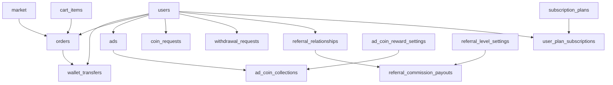

# Googer Database Table-by-Table Mapping

Status: live mapping based on current database and code
Date: 2026-06-17
Database snapshot query time: 2026-06-17 15:09:56 UTC

## Purpose

This file explains the main business tables one by one:

- what each table is for
- which backend writes it
- which flows depend on it
- which columns are most sensitive
- what changes in this table affect money, trust, or visibility

This is a business-table mapping, not a full raw schema dump.

## Snapshot counts

Live row counts checked on 2026-06-17:

- `users`: `21`
- `wallet_transfers`: `827`
- `orders`: `117`
- `ads`: `132`
- `ad_coin_collections`: `27`

## 1. `users`

### Purpose

Master identity table for:

- login identity
- profile identity
- wallet balance
- hold balance
- verification state
- suspension/deactivation state
- admin identity

### Written by

- main auth/profile flows
- wallet flows
- order settlement/refund flows
- admin user management
- verification flows
- chat presence indirectly through related tables

### Most sensitive columns

- `id`
- `user_id`
- `username`
- `user_type`
- `wallet_balance`
- `hold_balance`
- `status`
- `is_verified`
- `verification_status`
- `verification_badge_color`
- `verification_badge_tick_color`
- `suspended_wallet_access`

### Why this table is sensitive

- `wallet_balance` is real spendable money
- `hold_balance` is money locked pending settlement
- `user_type = 'admin'` decides the canonical Googer receiver in many code paths
- verification badge columns affect public trust signals

## 2. `wallet_transfers`

### Purpose

This is the most important money movement table.

It records:

- direct wallet transfers
- pending requests
- order holds
- commission holds
- refunds
- subscription charges
- ad promotion charges
- withdrawal holds
- Googer payouts

### Written by

- `walletController`
- `orderController`
- settlement/refund helpers
- withdrawal routes
- referral commission helpers
- subscription renewal logic
- admin finance routes

### Core columns

- `sender_id`
- `receiver_id`
- `amount`
- `status`
- `type`
- `note`
- `commission`
- `commission_percentage`

### Most sensitive meanings

- `amount` = the transactional amount for a business event
- `commission` = the value used by current Googer pooled balance math
- `status = 'accepted'` = counted into the current X-account formula

### High-risk dependency

Current Googer pooled balance is:

```sql
SELECT COALESCE(SUM(commission),0)
FROM wallet_transfers
WHERE status='accepted';
```

That means this table is the core sensitive ledger for the X-account.

## 3. `orders`

### Purpose

Tracks product order lifecycle and settlement anchors.

### Written by

- `createOrder`
- `createBulkOrder`
- order status update flows
- receive settlement
- cancel/refund flows

### Critical columns

- `buyer_id`
- `seller_id`
- `status`
- `total_price`
- `wallet_transfer_id`
- `seller_commission_transfer_id`
- `payment_method`
- `seller_discount_transfer_id`
- `reseller_user_id`
- `reseller_ref`
- `resell_commission_percentage`
- `resell_commission_amount`
- `resell_googer_commission_percentage`
- `resell_commission_transfer_id`

### Why this table is sensitive

It is the orchestration table that ties product sales to:

- buyer money holds
- seller commission holds
- seller discount holds
- resell commission holds
- final release on receive

## 4. `cart_items`

### Purpose

Staging table before order creation.

### Important business role

This is where reseller attribution gets locked into the checkout path before order creation.

### Critical columns

- `user_id`
- `product_id`
- `seller_id`
- `payment_methods`
- `product_discount`
- `reseller_ref`
- `resell_commission_percentage`

### Why it matters

If reseller attribution is wrong here, resell payout logic will be wrong later in `orders`.

## 5. `market`

### Purpose

Main product/marketplace table.

### Written by

- product creation/edit flows
- admin product moderation
- interaction counters

### Critical columns

- `user_id`
- `price`
- `promo_price`
- `status`
- `payment_methods`
- `commission_info`
- `product_code`

### Why it matters

`commission_info` and pricing columns influence:

- seller commission
- product discount behavior
- resell availability
- checkout amount

## 6. `ads`

### Purpose

Stores all advertising campaigns.

### Ad categories represented

- Photo and Video
- Product Promote
- Profile Promote

### Critical columns

- `ad_id`
- `user_id`
- `campaign_type`
- `budget`
- `spend`
- `remaining_budget`
- `status`
- `wallet_transfer_id`
- `impressions`
- `current_reach`
- `linked_product_id`

### Why this table is sensitive

Ad budget decisions generate large positive commission flows into the Googer pooled balance, especially through ad promote purchase rows and related refunds.

## 7. `ad_coin_reward_settings`

### Purpose

Global configuration for ad coin economics.

### Critical columns

- `user_reward_amount`
- `googer_commission_amount`
- `advertiser_charge_amount`
- `required_watch_seconds`
- `resell_googer_commission_percentage`
- `is_active`

### Why it matters

This single table controls live ad-coin reward math across the system.

## 8. `ad_coin_collections`

### Purpose

One row per successful ad coin collection event.

### Critical columns

- `ad_id`
- `ad_type`
- `user_id`
- `reward_amount`
- `commission`
- `advertiser_charge`

### Why it matters

Admin stats treat this table as the authoritative source for ad coin commission totals.

### Important current note

There is a live mismatch between:

- `SUM(ad_coin_collections.commission) = 6.50`
- some ad-coin-related `wallet_transfers` commission rows

So this table must stay in the documentation as a finance source of truth for ad coin reporting.

## 9. `coin_requests`

### Purpose

Stores admin-reviewed topup requests.

### Critical columns

- `user_id`
- `method_category`
- `method_name`
- `amount`
- `status`
- `rejection_reason`

### Why it matters

These requests are the manual capital-entry pipeline for users.

## 10. `withdrawal_requests`

### Purpose

Stores user withdrawal requests and their review state.

### Critical columns

- `user_id`
- `payment_method_id`
- `amount`
- `payment_details`
- `status`
- `wallet_transfer_id`

### Why it matters

This table ties user cash-out intent to wallet transfer hold/release rows.

## 11. `referral_relationships`

### Purpose

Stores who referred whom.

### Critical columns

- `user_id`
- `referred_by`
- `referral_code_used`
- `level`
- `commission_percentage`

### Why it matters

This is the base graph for multi-level referral payout.

## 12. `referral_level_settings`

### Purpose

Stores per-level commission settings.

### Critical columns

- `level`
- `name`
- `commission_percentage`
- `ad_commission_percentage`
- `is_active`

### Why it matters

Changing this table changes live referral payout behavior.

## 13. `referral_commission_payouts`

### Purpose

Stores generated referral payout events.

### Critical columns

- `buyer_id`
- `earner_id`
- `level`
- `source_type`
- `source_id`
- `pool_amount`
- `commission_percentage`
- `amount`
- `wallet_transfer_id`

### Why it matters

This table is the audit layer for referral distributions.

## 14. `subscription_plans`

### Purpose

Admin-managed plan catalog.

### Critical columns

- `slug`
- `name`
- `price`
- `duration_days`
- `badge_color`
- `verified_tick`
- `features`
- `is_active`
- `is_default`

### Why it matters

Plan price affects wallet charges.
Plan badge fields affect public trust/display state.

## 15. `user_plan_subscriptions`

### Purpose

Stores actual user subscription state.

### Critical columns

- `user_id`
- `plan_id`
- `price_paid`
- `status`
- `auto_renew`
- `started_at`
- `expires_at`
- `cancelled_at`

### Why it matters

Subscription billing and renewal worker behavior depend on this table.

## 16. `posts`

### Purpose

Social content for Googs.

### Why it still matters in business mapping

Although it is not the core finance ledger, it drives:

- traffic
- user retention
- reports/moderation
- ad placement context

## 17. Table Relationship Map



## 18. Most Sensitive Tables in Priority Order

1. `wallet_transfers`
2. `users`
3. `orders`
4. `ad_coin_reward_settings`
5. `withdrawal_requests`
6. `coin_requests`
7. `referral_level_settings`
8. `subscription_plans`

## 19. Final Truth

If one table must be treated as the center of financial risk, it is `wallet_transfers`.
If one support table decides who currently behaves like Googer inside live money paths, it is `users`, because admin-user resolution picks the canonical receiver from there.
