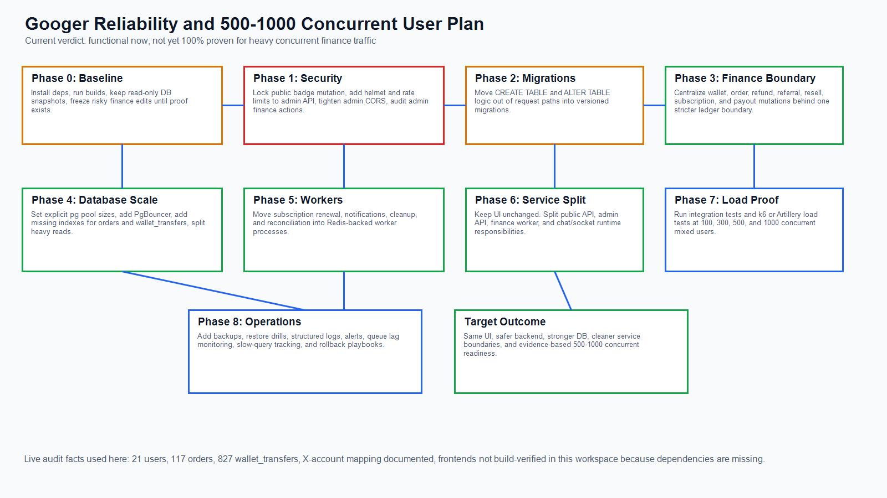

# Googer Reliability and 500-1000 Concurrent User Plan

Status: honest current-state audit plus migration plan
Date: 2026-06-17
Scope: `googernew-main` + `googeradminpanel` + shared PostgreSQL + finance-sensitive flows

## 1. Direct answer

No, I cannot honestly certify the current architecture as "100% proven reliable" yet.

What I can say:

- the current codebase has real transaction protection in many money paths
- the current live database is still small enough that it can feel fine in normal usage
- the current architecture is not yet hardened enough to safely promise 500-1000 concurrent active users with finance-sensitive actions

So the answer is:

- working: yes, in current small-scale form
- 100% proven: no
- ready for 500-1000 concurrent users without architecture hardening: no
- possible to get there without changing UI: yes

## 2. Evidence used for this audit

### Code evidence

- main backend security and rate limits: `googernew-main/backend/src/server.js`
- main/backend transaction-heavy wallet logic: `googernew-main/backend/src/controllers/walletController.js`
- main/backend order settlement logic: `googernew-main/backend/src/controllers/orderController.js`
- shared order finalization logic: `shared/utils/orderSettlementHelpers.js`
- admin backend routes: `googeradminpanel/server.js`
- admin payout/stats routes: `googeradminpanel/routes/admin.js`
- subscription badge mutation path: `googeradminpanel/controllers/subscriptionPlansController.js`

### Snapshot artifacts

- read-only DB snapshot:
  - `googernew-main/backend/transaction-audits/2026-06-17T15-24-19-521Z_architecture_reliability_audit.json`
- current sensitive-flow diagram:
  - `../images/GOOGER_SENSITIVE_FLOW_MAP.jpg`

### Live snapshot numbers at audit time

- users rows: `21`
- active-status user rows: `19`
- orders rows: `117`
- open orders: `38`
- wallet transfer rows: `827`
- pending wallet transfers: `21`
- total wallet balance across users: `37909.27`

These numbers matter because they show the current system is still at a very small live-data scale.
That means current smooth behavior does not prove heavy-growth readiness.

## 3. What is already good

### Finance mutation locking exists in many critical paths

The project already uses `BEGIN`, `COMMIT`, `ROLLBACK`, and `FOR UPDATE` in important money flows, including:

- wallet transfers
- order placement
- order receive / settlement
- withdrawal request flows
- admin payout flows

That is a real strength. It means the project is not starting from zero.

### Main backend already has basic HTTP protections

The main backend includes:

- `helmet(...)`
- broad API rate limiting
- stricter limiters for auth, uploads, and mutations

This is a decent base for the public app API.

### Sensitive balance mapping is now documented

The X-account / Googer pooled balance and the major commission paths are documented in:

- `ORIGINAL_SENSITIVE_FLOW_COMPARISON.md`
- `GOOGER_X_ACCOUNT_BREAKDOWN.md`
- `GOOGER_WALLET_ORDER_SETTLEMENT_MAPPING.md`

That lowers change risk because the money flows are now visible.

## 4. What blocks a "100% reliable" claim today

## A. Verification is incomplete in this workspace

I could not complete full app build verification here because the frontends do not currently have the required installed packages in this workspace.

Observed result:

- `googernew-main`: `next` command not available during build
- `googeradminpanel`: `next` command not available during build
- `googeradminpanel`: runtime module load also failed immediately because `dotenv` was not installed in this workspace copy

That does not prove the apps are broken in production.
It does mean this local workspace cannot currently give a full build-pass guarantee.

## B. Admin backend is weaker than main backend at the edge

The admin backend has custom headers and CORS, but it does not currently show the same public-edge hardening pattern as the main backend.

Current admin gap examples:

- no `helmet` middleware in `googeradminpanel/server.js`
- no visible rate-limit middleware in `googeradminpanel/server.js`

For a finance-sensitive admin backend, that is not enough.

## C. Public badge mutation route is still a real risk

Current route:

- `POST /api/subscriptions/apply-plan-badge`
- mounted publicly from `googeradminpanel/server.js`

This path mutates badge/subscription-related state from the admin-side service boundary.
Even if current callers are trusted, this is the wrong exposure shape for a sensitive system.

## D. Schema mutation logic still lives inside runtime request code

The codebase still contains many `CREATE TABLE IF NOT EXISTS` and `ALTER TABLE ... IF NOT EXISTS` calls inside normal app code.

Examples appear in:

- `googernew-main/backend/src/controllers/orderController.js`
- `googernew-main/backend/src/controllers/marketController.js`
- `googernew-main/backend/src/utils/subscriptionRenewal.js`
- `googeradminpanel/controllers/subscriptionPlansController.js`

This is one of the biggest architecture problems for reliability.

Why it is risky:

- request latency becomes less predictable
- startup behavior and request behavior get mixed
- schema drift becomes harder to reason about
- production rollback becomes dangerous
- multiple app instances can all attempt "self-healing" schema operations

## E. Database pooling is still implicit

Both services construct `new Pool(dbConfig)` without explicit pool sizing.

That means pool behavior is relying on default `pg` settings instead of being intentionally sized for:

- app instance count
- PgBouncer strategy
- Postgres connection ceiling
- workload split between public API, admin API, and jobs

At 500-1000 concurrent users, accidental connection pressure becomes a very common failure mode.

## F. Critical query indexing is not yet strong enough for growth

The live DB currently shows:

- `orders` only has the primary key index
- `wallet_transfers` has indexes on `sender_id`, `receiver_id`, and `status`
- there are no visible composite indexes for common reporting and finance patterns such as status+type or created_at-heavy scans

This is acceptable at tiny scale.
It is not what I would want before 500-1000 concurrent active users.

## G. Shared database plus shared money logic still creates coupling risk

Today both app surfaces write into the same operational tables:

- `users`
- `wallet_transfers`
- `orders`
- ads/referrals/subscriptions tables

That means:

- admin reporting and admin mutations can compete with public app traffic
- a bad admin route can affect public-user latency
- money logic is spread across multiple code locations rather than one finance boundary

## H. Synchronous file logging exists in hot code

The order controller writes debug logs with `fs.appendFileSync(...)`.

That blocks the Node.js event loop.
At low traffic it may be invisible.
At higher concurrency it becomes a latency amplifier.

## I. Background work still runs inside request-serving processes

Examples:

- subscription renewal worker starts from the main API process
- cleanup/background behavior exists in the admin server process

That is workable at small scale.
For higher concurrency, job execution should move into dedicated workers.

## J. There is still not enough automated proof

I did not find a meaningful automated end-to-end or integration test suite that proves:

- order placement and refund invariants
- wallet transfer invariants
- admin payout safety
- resell and referral correctness under repeated/concurrent attempts
- ad and subscription settlement idempotency

This is the largest gap behind the words "100% sure."

## 5. Honest current readiness

### What I would trust today

- a small live user base
- light to moderate daily activity
- careful manual operations
- ongoing close monitoring by the team

### What I would not promise today without hardening

- 500-1000 concurrent active users
- heavy simultaneous wallet transfers
- mass campaign traffic spikes
- high-confidence "no lag, no finance mistake" claims

## 6. Target architecture for 500-1000 concurrent users

UI can stay the same.
The change should happen behind the UI.

## Recommended target shape

1. unchanged web frontend
2. unchanged mobile/frontend clients
3. unchanged admin frontend UI
4. public API service for normal user traffic
5. finance service or finance module boundary for wallet/order/subscription settlement
6. admin API service for operational actions
7. dedicated worker service for renewals, notifications, refunds, reconciliation
8. Redis for rate-limit state, job queueing, cache, and socket scaling
9. PostgreSQL primary for writes
10. PostgreSQL read replica for admin reporting and analytics once traffic grows
11. PgBouncer in front of PostgreSQL
12. object storage/CDN for uploads and media
13. central logs, metrics, and alerts

## 7. Step-by-step plan to reach that target

## Phase 0 - Freeze and measure

Goal: stop guessing and create a clean baseline.

Actions:

1. freeze finance-sensitive logic changes until tests and migrations exist
2. keep the read-only snapshot artifact created in this audit
3. create a repeatable "before and after" snapshot process for:
   - `users`
   - `wallet_transfers`
   - `orders`
   - ad/referral/subscription tables
4. install missing workspace dependencies so build verification is possible
5. add a formal readiness checklist for every deploy

Result:

- we know what "good" currently looks like
- every hardening step can be compared against a snapshot

## Phase 1 - Close security exposure first

Goal: remove the easiest ways to make expensive mistakes.

Actions:

1. remove or strictly gate public mutation access to `apply-plan-badge`
2. add `helmet` to the admin backend
3. add rate limiting to the admin backend
4. split internal admin-to-main/service-to-service actions from public routes
5. tighten admin CORS to only known origins in production
6. add audit logging for every admin finance action:
   - payout
   - topup approval
   - withdrawal approval
   - badge/subscription mutation

Result:

- less chance of security mistakes
- cleaner trust boundaries

## Phase 2 - Move all schema changes into migrations

Goal: stop changing schema during runtime requests.

Actions:

1. inventory every `CREATE TABLE IF NOT EXISTS`
2. inventory every `ALTER TABLE ... IF NOT EXISTS`
3. convert them into explicit migration files
4. make app startup fail fast if required schema is missing
5. keep migrations versioned and ordered

Result:

- predictable startup
- safer deploy/rollback behavior
- less concurrent-node weirdness

## Phase 3 - Create a strict finance boundary

Goal: keep all money math and money writes in one hardened place.

Actions:

1. centralize these flows behind one module or internal service:
   - wallet transfer
   - order hold
   - order settlement
   - refund
   - referral distribution
   - resell payout
   - subscription billing
   - admin pooled-balance payout
2. require one transaction owner per financial command
3. add idempotency keys for all payment-like mutations
4. add invariant checks:
   - no negative wallet unless explicitly allowed
   - hold release cannot exceed original hold
   - pooled balance payout cannot bypass commission ledger
5. add append-only audit records for every sensitive mutation

Result:

- less duplication
- easier concurrency testing
- easier financial reconciliation

## Phase 4 - Fix database access for growth

Goal: make PostgreSQL survive concurrency spikes without lying or stalling.

Actions:

1. set explicit pool sizes in both services
2. add PgBouncer
3. add missing indexes, starting with:
   - `orders(status)`
   - `orders(buyer_id)`
   - `orders(seller_id)`
   - `orders(order_number)`
   - `orders(wallet_transfer_id)`
   - `wallet_transfers(status, type)`
   - `wallet_transfers(created_at DESC)`
   - `wallet_transfers(sender_id, created_at DESC)`
   - `wallet_transfers(receiver_id, created_at DESC)`
   - partial indexes for high-frequency pending/accepted scans where needed
4. move admin dashboards and long reports to replica or precomputed summary tables
5. add query timing and slow-query logging

Result:

- less lock contention
- faster reads
- safer connection usage

## Phase 5 - Move background work out of web processes

Goal: stop mixing user request latency with jobs.

Actions:

1. move subscription renewals into a worker
2. move notification fanout into a worker
3. move reconciliation and cleanup jobs into a worker
4. use Redis-backed queues
5. make each job idempotent and retry-safe

Result:

- lower request latency
- better retry behavior
- safer scaling

## Phase 6 - Split deployment responsibilities

Goal: keep one hot path from hurting every other path.

Recommended service layout:

1. public API service
2. admin API service
3. finance worker/service
4. chat/socket service
5. scheduler/worker service

Important:

- this does not require UI redesign
- the frontend can keep calling the same route shapes through a gateway or reverse proxy

## Phase 7 - Add automated proof before claiming 500-1000 concurrency

Goal: replace belief with proof.

Required tests:

1. integration tests for wallet transfer success/failure
2. integration tests for order place/cancel/receive/refund
3. integration tests for resell/referral splits
4. admin payout ledger tests
5. repeated-request idempotency tests
6. load tests for:
   - 100 concurrent normal feed users
   - 100 concurrent order placements
   - 100 concurrent wallet transfers
   - 300 mixed concurrent users
   - 500 mixed concurrent users
   - 1000 mixed concurrent users

Suggested tools:

- k6 or Artillery for load
- Jest/Vitest or Node integration harness for API invariants
- snapshot diff script for finance reconciliation

Result:

- we can finally say what the system really handles

## Phase 8 - Production reliability controls

Goal: survive real incidents.

Actions:

1. daily Postgres backups with tested restore
2. monitoring for:
   - DB connections
   - slow queries
   - queue lag
   - 5xx rate
   - payout/refund failures
3. structured logs with request id / user id / order id / transfer id
4. deploy rollback plan
5. feature flags for risky finance changes

Result:

- fewer silent failures
- faster incident recovery

## 8. Practical server map for 500-1000 concurrent users

This is the best practical starting map, not a magic guarantee.

### Minimum serious setup

1. load balancer / reverse proxy
2. `2-3` public API instances
3. `1` admin API instance
4. `1-2` finance/worker instances
5. `1` chat/socket instance to start, then Redis adapter if horizontally scaled
6. `1` Redis instance
7. `1` PostgreSQL primary with SSD storage
8. `1` PgBouncer layer
9. optional read replica for reporting after growth

### Example starting sizes

- public API: `2 vCPU / 4-8 GB RAM` each
- admin API: `1-2 vCPU / 2-4 GB RAM`
- finance worker: `2 vCPU / 4 GB RAM`
- Redis: `2-4 GB RAM`
- PostgreSQL: `4 vCPU / 16 GB RAM` with good SSD IOPS

These are only starting points.
The correct size must be validated with real load tests.

## 9. What we should say today to investors, partners, or internal stakeholders

Safe version:

"The current architecture works for the present small live load, and the core money paths already use transactional locking. Before we claim reliable 500-1000 concurrent-user readiness, we still need security hardening, migration cleanup, dedicated finance boundaries, stronger indexing, worker separation, and load-test proof."

That statement is accurate and defensible.

## 10. Final verdict

### Current truth

- functional architecture: yes
- documented critical flows: yes
- small-scale usable: yes
- 100% verified locally from this workspace: no
- 500-1000 concurrent-user ready today: no

### Best next move

Do not change the UI.
Harden the backend and database layers in the order listed above.

If those phases are completed properly, this project can be moved to a much more reliable 500-1000 concurrent-user architecture without redesigning the user-facing interface.

## 11. Visual roadmap

Roadmap image:

- `../images/GOOGER_500_1000_SCALING_ROADMAP.jpg`

Visual embed:

