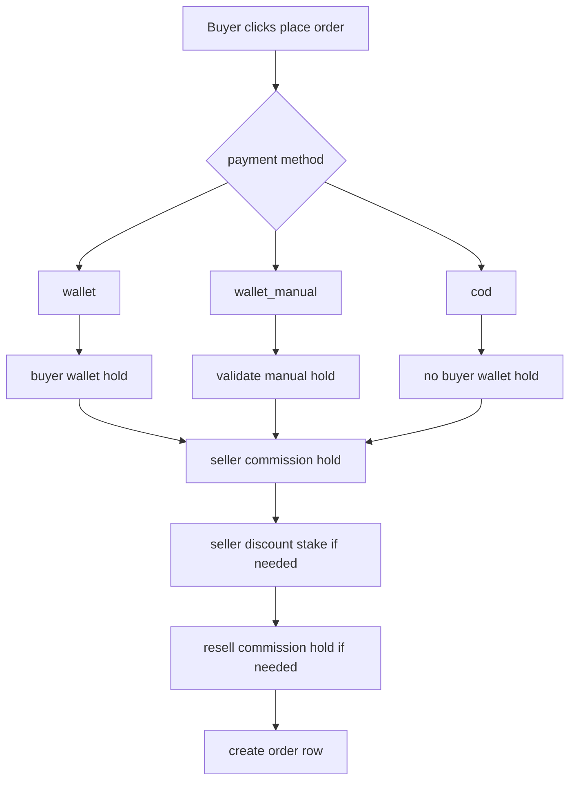
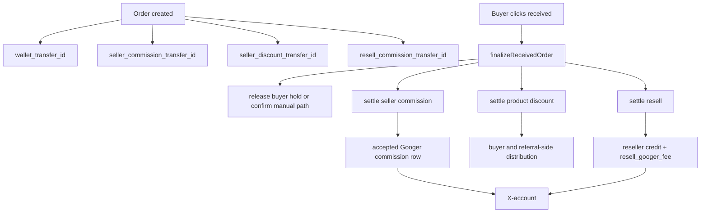

# Googer Wallet and Order Settlement Mapping

Status: current settlement behavior map based on live code
Date: 2026-06-17

## Purpose

This file explains the most sensitive settlement path in the project:

- wallet holds
- order creation
- seller commission holds
- seller discount holds
- resell holds
- receive-time settlement
- cancellation refunds
- differences between wallet, Googer Manual Payment, and COD

Main sources:

- `googernew-main/backend/src/controllers/walletController.js`
- `googernew-main/backend/src/controllers/orderController.js`
- `shared/utils/orderSettlementHelpers.js`
- `shared/utils/orderRefundHelpers.js`

## 1. Settlement Modes

Current product payment modes in practice:

- `wallet`
- `wallet_manual`
- `cod`

### Meaning

- `wallet` = Googer Payment wallet hold flow
- `wallet_manual` = Googer Manual Payment seller-specific hold flow
- `cod` = cash on delivery

## 2. Main Entities Used in Settlement

Settlement depends on these tables:

- `users`
- `wallet_transfers`
- `orders`
- `market`
- `cart_items`

Important order-linked transfer ids:

- `wallet_transfer_id`
- `seller_commission_transfer_id`
- `seller_discount_transfer_id`
- `resell_commission_transfer_id`

## 3. Wallet Hold Types

### A. Buyer wallet hold

For `wallet` payments:

- buyer balance is moved into hold
- transfer type is `order_hold`
- sender and receiver are both the buyer for Googer Payment holds

### B. Manual seller-targeted hold

For `wallet_manual`:

- buyer creates an `order_hold` pending row toward the seller
- verification step checks that hold exists and matches seller and amount
- bulk manual orders support one seller only

### C. Seller commission hold

At order creation:

- seller commission is held separately
- linked through `seller_commission_transfer_id`

### D. Seller discount hold

If the product discount logic requires it:

- seller discount is staked separately
- linked through `seller_discount_transfer_id`

### E. Resell commission hold

If reseller attribution exists:

- seller balance is reduced
- seller hold balance increases
- `resell_commission` transfer is created in `pending`

## 4. Order Creation Flow

## 5. `wallet` Payment Settlement

### At order creation

1. total required is calculated from product price plus shipping
2. buyer balance is checked
3. buyer `wallet_balance` decreases
4. buyer `hold_balance` increases
5. `wallet_transfers` row of type `order_hold` is created
6. seller commission hold may also be created
7. seller discount hold may also be created
8. resell hold may also be created

### At receive

Advanced settlement does this:

1. buyer hold is released
2. seller receives net amount:
   - order gross
   - minus Googer product commission
   - minus seller-funded discount if applicable
3. Googer commission is inserted as accepted `commission_hold` if not already settled from seller hold
4. buyer-side product discount distribution runs
5. resell hold is released if present

## 6. `wallet_manual` Payment Settlement

### At hold creation

The manual payment flow creates a pending `order_hold` toward a specific seller.

Important note:

- the UI/business rule enforces one seller per manual order group

### Verification rules

The backend verifies:

- buyer id
- seller id
- transaction id
- expected amount
- transfer is still pending

### At receive

When buyer confirms received:

1. manual group is loaded
2. backend checks all orders in the group are `wallet_manual`
3. `finalizeReceivedOrder` runs for each order
4. hold-backed values are released
5. discount/resell/commission linked rows are finalized

## 7. `cod` Payment Settlement

### At order creation

COD does not create a buyer wallet hold.

But it still may create:

- seller commission hold
- seller discount hold
- resell commission hold

Important current rule:

- if seller cannot cover required COD-side Googer commission hold, order creation can fail

### At receive

COD settlement uses receive-time logic.

For seller commission hold:

- seller hold balance decreases
- held commission row becomes `accepted`
- receiver becomes canonical Googer user
- commission counts into the X-account

### Auto-receive

COD orders can auto-receive after 48 hours in the current helper flow.

## 8. Seller Commission Hold Logic

### Creation

At order creation:

- commission percentage is calculated from product commission config
- seller balance is checked
- seller wallet may decrease
- seller hold increases
- transfer row is created and linked as `seller_commission_transfer_id`

### Receive-time behavior

#### If payment is COD

- seller hold is reduced
- commission transfer becomes accepted to Googer
- this contributes to X-account

#### If payment is not COD

- seller hold is released back to seller
- a fresh accepted `commission_hold` row may be inserted for Googer commission

## 9. Seller Discount Hold Logic

### Creation

Seller discount staking can happen during order creation.

### Receive-time behavior

- held seller discount can be reassigned to buyer-side settlement
- product discount commission distribution is triggered
- some rows become `completed`

### Cancel-time behavior

- if order is cancelled, seller discount amount is restored to seller according to payment-method-specific rules

## 10. Product Discount Distribution

After receive, buyer-side product discount distribution can run.

Current business concept:

- seller-funded discount amount becomes a pool
- Googer share may be taken
- referral/upline logic may run
- remaining amount flows to buyer side according to the current rules

This is one of the most sensitive indirect finance paths because it combines:

- order completion
- referral levels
- wallet credits
- Googer commission

## 11. Resell Settlement

### At order creation

- seller wallets front the resell pool
- seller hold increases by the resell amount
- pending `resell_commission` row is created

### At receive

1. seller hold decreases by full resell pool
2. reseller wallet receives reseller share
3. resell hold transfer becomes `completed`
4. separate `resell_googer_fee` accepted row is inserted
5. Googer share enters X-account through that accepted commission row

## 12. Refund / Cancel Logic

`refundCancelledOrder` handles rollback.

### Buyer hold refund

If wallet hold exists and is still refundable:

- buyer hold decreases
- buyer wallet increases
- hold transfer is cancelled if unused

### Seller commission refund

If seller commission hold exists and is still refundable:

- seller hold decreases
- seller wallet increases
- transfer is cancelled if unused

### Seller discount refund

If seller discount row exists:

- seller gets value back according to payment method and transfer status

### Resell refund

If resell hold exists and is still refundable:

- seller hold decreases
- seller wallet increases
- pending resell transfer is cancelled

## 13. Settlement Diagram

## 14. X-Account Touch Points Inside Settlement

Settlement feeds the X-account through these rows:

- `commission_hold`
- `resell_googer_fee`
- some `referral_commission`-style Googer rows tied to discount logic
- subscription and other non-order flows outside the order controller

Current live totals relevant to settlement and wallet-linked X sources:

- `commission_hold`: `65.85`
- `resell_googer_fee`: `5.00`
- `subscription` combined: `282.00`
- `withdrawal_hold`: `340.00`

## 15. Most Sensitive Breakpoints

If you change any of these, you are changing real settlement behavior:

1. buyer hold creation
2. seller commission hold creation
3. seller discount staking
4. resell hold creation
5. receive-time settlement sequencing
6. cancel-time refund sequencing
7. canonical Googer receiver resolution
8. any logic that writes accepted `commission` rows

## 16. Final Truth

Googer settlement is not one transfer.
It is a bundle of coordinated holds and releases tied together by `orders` plus multiple `wallet_transfers` ids.
That is why order settlement, wallet settlement, and the Googer X-account have to be documented together.
