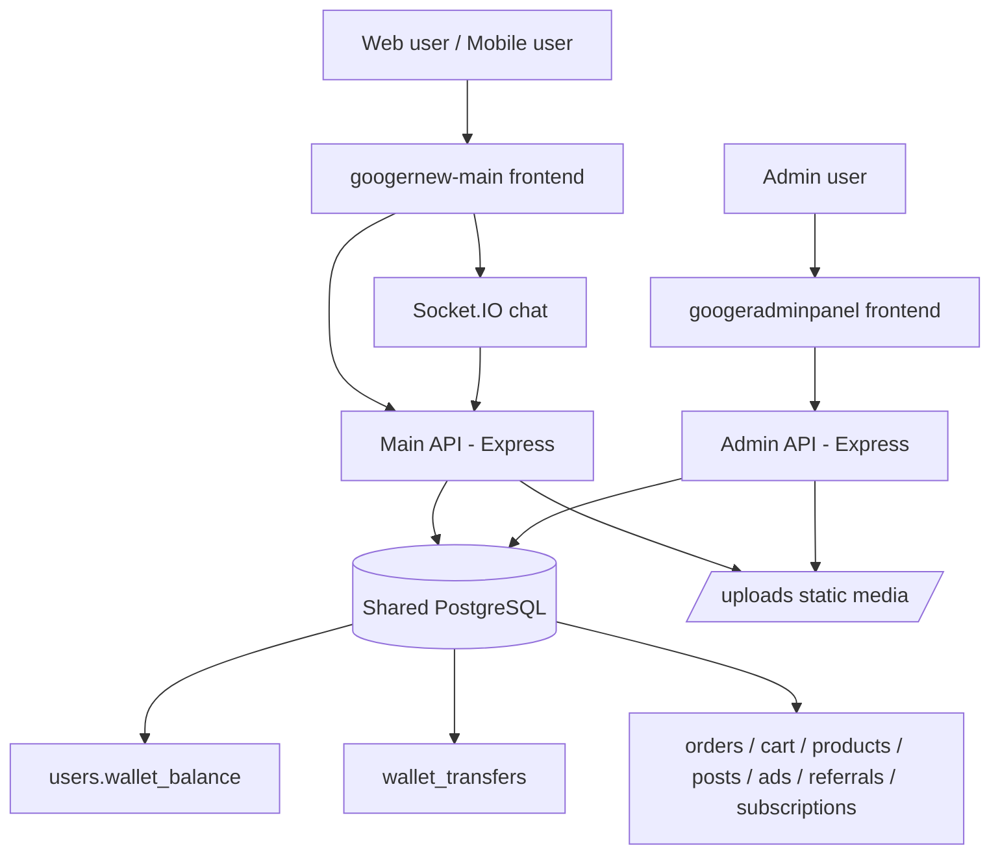
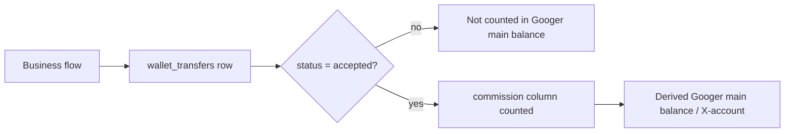
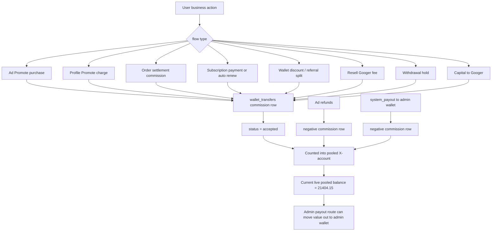
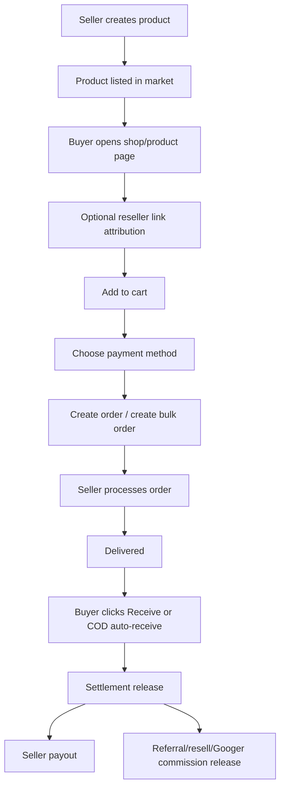
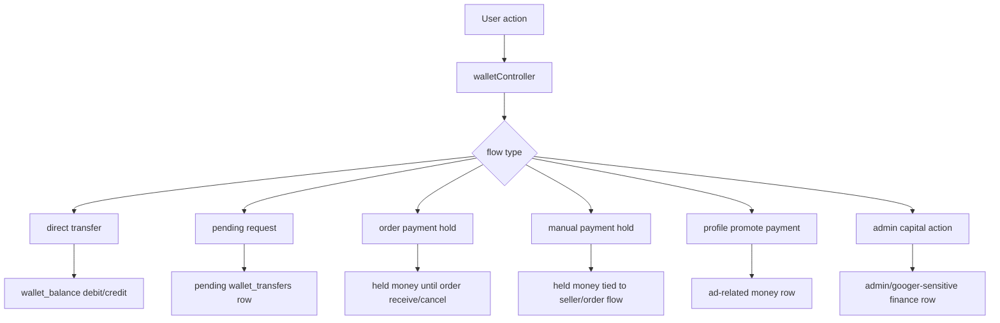
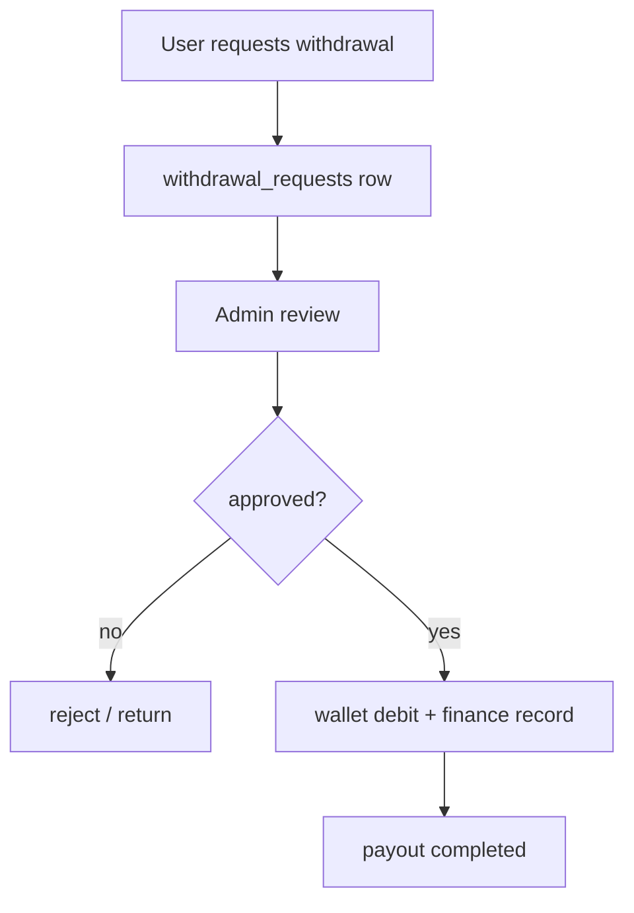
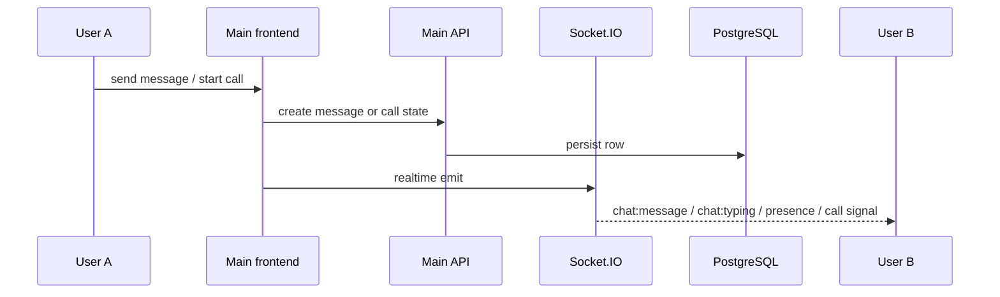
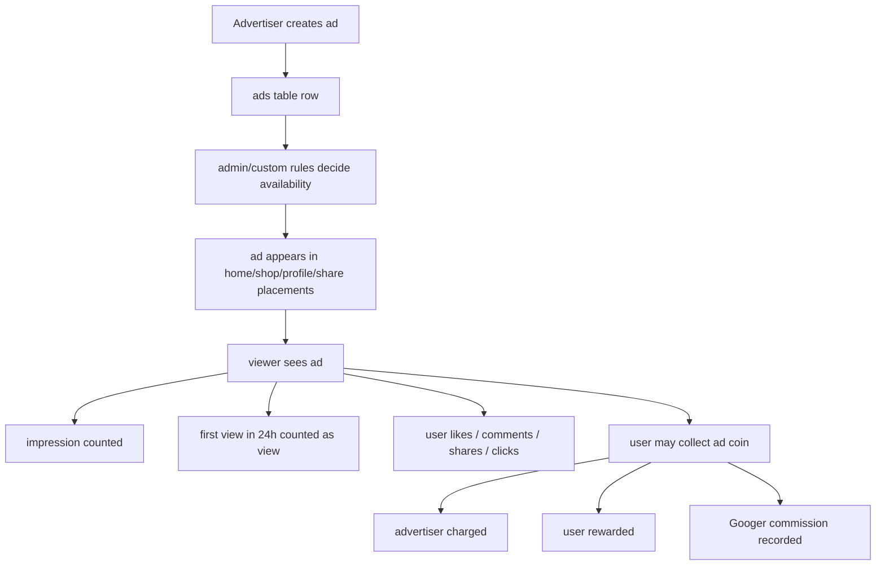
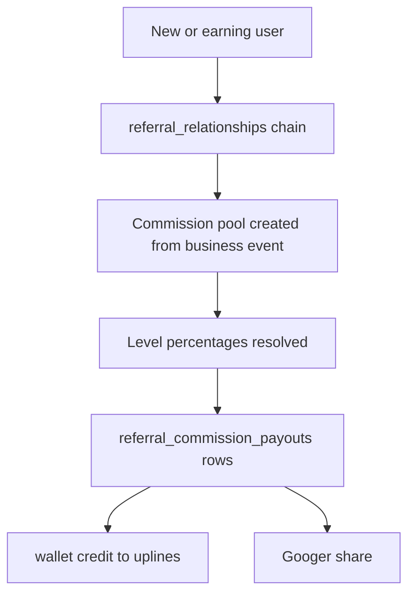
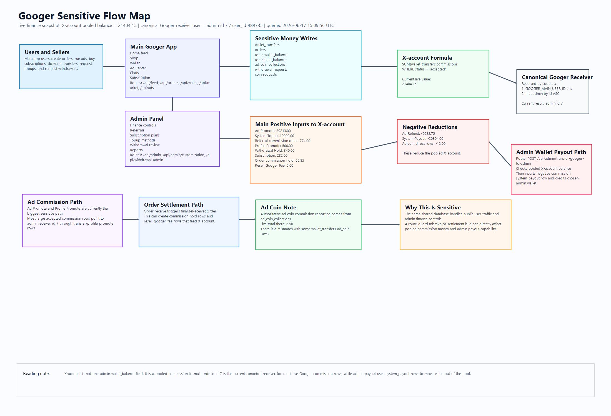

# Googer Master Flow, Logic, and Sensitive Mapping

Status: working current-state architecture map based on code and existing docs
Date: 2026-06-17
Scope: `googernew-main` + `googeradminpanel` + shared PostgreSQL + wallet/order/ad/referral/subscription/chat logic

## Purpose

This is the single combined map for:

- main app page flows
- admin panel flows
- shop flow
- home feed flow
- ad flow for all 3 ad types
- wallet and transaction flow
- chat flow
- order and payment flow
- referral flow
- resell flow
- subscription flow
- Googer main balance / X-account mapping
- sensitive finance exposure points

This is a read-only architecture document.
It does not authorize logic changes to locked money paths in:

- `googernew-main/docs/CRITICAL_PROCESSES.md`
- `googernew-main/docs/wallet-sell-buy-flow.md`
- `googernew-main/docs/resell-commission-flow.md`
- `googernew-main/docs/AD_ENGINE_RULES.md`
- `googernew-main/docs/current-ad-logic-lock.md`
- `googernew-main/docs/Main googer balance.md`

## 1. Current System Shape

Googer is not one simple app.
It is currently two backend surfaces sharing one database.

### Main user system

- frontend: `googernew-main/app`
- backend: `googernew-main/backend/src/server.js`
- purpose:
  - registration and login
  - home feed
  - googs posts
  - public and private profiles
  - shop / product browsing
  - cart and checkout
  - wallet usage
  - topup / sell pages
  - ad creation and ad consumption
  - chat and calling
  - subscription purchase

### Admin system

- frontend: `googeradminpanel/app/admin`
- backend: `googeradminpanel/server.js`
- purpose:
  - user management
  - moderation
  - product and post review
  - ad review and history
  - topup method management
  - topup request review
  - withdrawal review
  - referral settings
  - subscription plan management
  - Googer/admin wallet actions
  - reports and transaction history

### Shared database

- both systems use the same PostgreSQL database
- both systems read and write shared wallet/order/ad/referral/subscription tables
- the biggest current risk is not only performance
- the bigger risk is shared access to sensitive rows and shared finance logic

### Realtime layer

- chat uses REST plus Socket.IO
- socket attach point: `googernew-main/backend/src/realtime/chatSocket.js`
- only main backend currently runs the realtime chat socket

## 2. High-Level Architecture Diagram



## 3. Main App Surface Map

### Public and user-facing routes

- `/`
  - home feed
- `/login`
  - sign in
- `/register`
  - sign up with optional referral code
- `/[username]`, `/u/[username]`, `/profile/[user]`
  - public profile surfaces
- `/product/[shareCode]`
  - product share landing
- `/product/[shareCode]/[resellerRef]`
  - reseller-attributed product landing
- `/share/[shareCode]`
  - shared item landing
- `/share/[shareCode]/[resellerRef]`
  - reseller-attributed share landing
- `/share/product/[shareCode]`
  - public shared product page
- `/share/product/[shareCode]/[resellerRef]`
  - public shared product with resell attribution
- `/share/ad/[adId]`
  - public shared ad page
- `/share/goog/[postId]`
  - public shared post page

### Authenticated dashboard surfaces

- `/dashboard`
  - logged-in home feed
- `/dashboard/shop`
  - shop feed and order actions
- `/dashboard/shop/[id]`
  - product detail / order state surface
- `/dashboard/googs/[id]`
  - post detail
- `/dashboard/chats`
  - chat, calls, presence, typing
- `/dashboard/profile`
  - own profile management, products, saved items, saved ads
- `/dashboard/settings`
  - account settings
- `/dashboard/categories`
  - category browsing
- `/dashboard/wallet`
  - wallet summary
- `/dashboard/wallet/my-wallet`
  - transaction-focused wallet surface
- `/dashboard/wallet/request`
  - request/transfer behavior
- `/dashboard/wallet/transactions`
  - wallet history
- `/dashboard/wallet/topup`
  - p2p buy / topup market
- `/dashboard/wallet/sell`
  - p2p sell market
- `/dashboard/wallet/ad-center`
  - ad center
- `/dashboard/wallet/subscription`
  - subscription purchase/management
- `/dashboard/wallet/withdrawal`
  - withdrawal request
- `/dashboard/wallet/verification`
  - verification/KYC style flow
- `/dashboard/ad-campaign/photo-video`
- `/dashboard/ad-campaign/product-promote`
- `/dashboard/ad-campaign/profile-promote`
  - 3 ad creation surfaces

## 4. Admin Panel Surface Map

- `/admin`
  - dashboard/stats
- `/admin/users/*`
  - all users, sellers, employees, deactivated, deleted, user drilldowns
- `/admin/products/*`
  - product review and product ads area
- `/admin/posts`
  - post moderation
- `/admin/shop`
  - admin view of shop items
- `/admin/referrals`
  - referral mapping and settings
- `/admin/subscription`
  - subscription plan management and purchases
- `/admin/reports/*`
  - profile/order/goog/comment/ad reports
- `/admin/verification`
  - identity review
- `/admin/wallet/*`
  - main wallet, capital transfer, coin collections, topup, withdrawals, profile promote, transactions
- `/admin/customization`
  - categories, commissions, ad settings, reach tiers, promo codes, allowed countries
- `/admin/chats`
  - admin chat surface
- `/admin/notifications`
  - notification center

## 5. Main Backend Domain Ownership

Current mounted main API domains from `googernew-main/backend/src/server.js`:

- `/api/auth`
- `/api/wallet`
- `/api/ads`
- `/api/market`
- `/api/categories`
- `/api/googs`
- `/api/orders`
- `/api/chat`
- `/api/cart`
- `/api/feed`
- `/api/promo-codes`
- `/api/admin/customization`
- `/api/admin`
- `/api/verification`
- `/api/withdrawal-admin`
- `/api/withdrawals`
- `/api/coin-requests`
- `/api/p2p-ads`
- `/api/p2p-sell-ads`
- `/api/subscriptions`
- `/api/subscription-plans`
- `/api/stickers`

## 6. Admin Backend Domain Ownership

Current mounted admin API domains from `googeradminpanel/server.js`:

- `/api/auth`
- `/api/users`
- `/api/products`
- `/api/posts`
- `/api/wallet`
- `/api/market`
- `/api/order`
- `/api/ads`
- `/api/categories`
- `/api/admin/customization`
- `/api/chat`
- `/api/promo-codes`
- `/api/admin`
- `/api/verification`
- `/api/withdrawal-admin`
- `/api/withdrawal`
- `/api/coin-requests`
- `/api/admin/subscription-plans`
- `/api/subscriptions`
- `/api/admin/referrals`
- `/api/reports`
- `/api/notifications`

## 7. Core Shared Tables and Sensitive Data

The most important current data objects are:

- `users`
  - wallet, hold, account type, suspension/deactivation state
- `wallet_transfers`
  - central money movement and commission record
- `orders`
  - checkout, delivery, receive, resell, seller settlement state
- `cart_items`
  - checkout staging plus reseller attribution
- `market`
  - products and product commission config
- `posts`
  - googs social content
- `ads`
  - all ad types, budget, status, reach, impressions
- `ad_coin_collections`
  - ad reward collection history
- `coin_requests`
  - topup requests
- `withdrawal_requests`
  - payout requests
- `referral_relationships`
  - who referred whom
- `referral_level_settings`
  - level percentages
- `referral_commission_payouts`
  - referral payout records
- `user_plan_subscriptions`
  - user subscription state
- `subscription_plans`
  - admin-managed plans

## 8. Googer Main Balance / X-Account Mapping

Important: the Googer main balance is not `users.wallet_balance`.

Current formula from docs and code:

```sql
SELECT COALESCE(SUM(commission), 0)
FROM wallet_transfers
WHERE status = 'accepted';
```

That means the current "Googer main balance" or "X account" is an aggregate derived from accepted commission rows.

### Live snapshot of X-account

Live database query executed on 2026-06-17 at 15:09:56 UTC:

```sql
SELECT COALESCE(SUM(commission),0)
FROM wallet_transfers
WHERE status = 'accepted';
```

Current result at that time:

```text
21404.15
```

This is the current pooled Googer commission balance according to the live database.

### Which user acts as the Googer receiver in code

The system does not hardcode the Googer receiver to one normal wallet row by default.
The main backend resolves it like this:

1. `GOOGER_MAIN_USER_ID` env override, if present and valid
2. otherwise the first `users` row where `user_type = 'admin'`, ordered by `id ASC`
3. otherwise a username fallback

In the current live data, the canonical admin chosen by that rule is:

- internal `id`: `7`
- readable `user_id`: `989735`
- username: `admin`
- display name: `Googer Support`
- status: `Active`

Current live admin rows:

- `id 7` / `user_id 989735` / `username admin` / wallet `0.00` / active
- `id 9` / `user_id 123456` / `username test12` / wallet `0.00` / active
- `id 22` / `user_id 111111` / `username g` / wallet `14306.80` / deleted
- `id 23` / `user_id 222222` / `username g1` / wallet `0.00` / active

Important:

- the X-account is the pooled commission formula result: `21404.15`
- the canonical receiver user for most current Googer commission rows is admin `id 7`
- that does not mean `users.wallet_balance` for admin `id 7` equals the X-account
- those are different concepts in the current architecture

### Current top sources feeding X-account

Live grouped accepted commission rows currently sum like this:

| bucket | net commission |
|---|---:|
| ad promote | 39213.00 |
| system topup | 10000.00 |
| referral commission other | 774.00 |
| profile promote | 500.00 |
| withdrawal hold | 340.00 |
| subscription | 282.00 |
| sell discount related | 200.00 |
| commission hold | 65.85 |
| product commission | 25.00 |
| resell Googer fee | 5.00 |
| ad coin Googer via referral commission | 4.05 |
| ad coin direct wallet rows | -12.00 |
| ad refund | -9688.75 |
| system payout | -20304.00 |

This tells us the strongest current sensitive path is ad-related money, especially:

- `Ad Promote - ...` rows
- `profile_promote` rows
- ad refund rows
- ad coin related commission rows

### Important ad coin mismatch to document

There is a live bookkeeping mismatch between:

- `ad_coin_collections.commission` total
- ad-coin-flavored rows inside `wallet_transfers`

Live totals checked on 2026-06-17:

- `ad_coin_collections` commission total = `6.50`
- `wallet_transfers` where `type = 'ad_coin'` commission total = `-12.00`

So for ad coin, the admin stats route is correct to treat `ad_coin_collections` as the more authoritative source than naive `wallet_transfers.type = 'ad_coin'` summing.

It grows from flows such as:

- wallet discount/googer commission
- ad coin commission
- resell Googer fee
- some topup/withdrawal finance rows
- subscription and other finance logic where commission is stored in accepted transfers

It is separate from:

- admin user's own `users.wallet_balance`
- ordinary seller or user balances
- pending holds

### X-account concept diagram



### X-account sensitive path diagram



## 9. Home Feed Flow

Home feed is the main mixed-consumption surface.

### What appears there

- googs posts
- promoted ads
- profile promote ads
- photo/video ads
- product promote ads
- user social interactions

### Backend owner

- route: `/api/feed/home`
- controller: `feedController.getHomeFeed`

### Business logic

1. frontend requests home feed
2. backend builds mixed feed data
3. feed includes organic and sponsored items
4. shared ad engine components render sponsored entries
5. user interactions call back into `googs`, `market`, and `ads`/`market` endpoints

### Home feed rules

- home feed uses shared ad engine
- ad interaction state must stay in shared `adStore`
- ad likes/views/impressions cannot be page-local guesses
- backend is source of truth for counts

## 10. Shop Flow

Shop is the main product commerce surface.

### Shop business roles

- seller creates product
- buyer browses product
- reseller may share product with `resellerRef`
- buyer adds to cart
- buyer chooses payment method
- order is created
- seller ships/delivers
- buyer receives
- settlement releases to seller and related commission targets

### Shop flow diagram



### Payment methods currently exposed in cart

From the main cart/sidebar flow:

- manual wallet payment
- Googer Payment
- cash on delivery

### Payment method meaning

#### 1. Manual wallet payment

- buyer locks cart to a seller
- manual seller-targeted payment/hold flow is created in wallet layer
- `verifyManualPaymentHold` is used to confirm the hold state
- order then depends on that manual payment relationship
- this is sensitive because it mixes cart/order logic with wallet transfer logic

#### 2. Googer Payment

- buyer pays from Googer wallet through backend wallet/order flow
- payment is usually represented as held/controlled transfer until receive or final settlement event
- cancellation rules differ from normal direct wallet transfers

#### 3. Cash on Delivery

- no upfront buyer wallet debit
- order status drives final settlement
- some related commissions are held differently
- in resell cases seller may temporarily front a hold amount for the commission pool

### Order routes

- `/api/orders/create`
- `/api/orders/create-bulk`
- `/api/orders/buyer`
- `/api/orders/seller`
- `/api/orders/:id/status`
- `/api/orders/group/:orderNumber/status`
- `/api/orders/group/:orderNumber/cancel`

## 11. Wallet and Transaction Flow

Wallet is one of the most sensitive areas in the entire system.

### Current wallet capabilities

- direct transfer
- transfer request
- pending request acceptance/rejection
- cancel request
- pay order
- pay profile promote
- record promo ad
- admin capital add
- history view

### Main wallet routes

- `/api/wallet/search-users`
- `/api/wallet/request`
- `/api/wallet/verify-manual-payment-hold`
- `/api/wallet/pending-requests`
- `/api/wallet/respond`
- `/api/wallet/cancel`
- `/api/wallet/transfer`
- `/api/wallet/pay-order`
- `/api/wallet/pay-profile-promote`
- `/api/wallet/record-promo-ad`
- `/api/wallet/admin/add-capital`
- `/api/wallet/history`

### Wallet transaction model

Most business-money movement becomes a `wallet_transfers` row with:

- `sender_id`
- `receiver_id`
- `amount`
- `commission`
- `commission_percentage`
- `type`
- `status`
- `note`

### Wallet flow diagram



### Wallet discount logic

Accepted wallet sell/buy discount rules are separately documented in:

- `googernew-main/docs/wallet-sell-buy-flow.md`

Key current rule:

- discount pool is split
- Googer gets a commission share
- referral levels may get shares
- leftover/refund rules apply based on chain availability
- internal split rows should not all appear as ordinary wallet history

## 12. Topup and P2P Buy/Sell Flow

There are two related but different wallet acquisition flows:

### A. Admin-reviewed topup requests

- user submits request through `coin_requests`
- admin reviews and approves/rejects
- topup methods are admin-managed

Main routes:

- `/api/coin-requests`
- `/api/coin-requests/my`
- `/api/coin-requests/admin`
- `/api/coin-requests/admin/:id/review`
- `/api/coin-requests/active-topup-methods`

Admin routes:

- `/api/coin-requests/topup-methods`
- `/api/coin-requests/admin/requests`
- `/api/coin-requests/admin/:id/review`

### B. P2P buy/sell markets

- `/api/p2p-ads`
- `/api/p2p-sell-ads`

These support:

- listing ads
- starting transactions
- lock/unlock
- proof upload
- confirm/cancel/complete
- transaction event streaming

This is effectively a second marketplace inside the wallet domain.

## 13. Withdrawal Flow

### User side

- user loads withdrawal settings and payment methods
- user submits withdrawal request
- user views own requests
- user may cancel pending request

### Admin side

- admin loads requests
- admin reviews request
- admin updates settings and methods
- transaction history is available in admin surface

### Flow diagram



## 14. Googs / Social Post Flow

Main social post routes:

- `/api/googs`
- `/api/googs/public/:id`
- `/api/googs/saved`
- `/api/googs/user/:userId`
- like, subscribe, share, view, report, comment, save endpoints

### Business logic

1. user creates post
2. other users view/like/comment/share/report
3. post owner gains social reach, not direct wallet settlement
4. reports flow into admin moderation surfaces

This is the social side of the social-commerce platform.

## 15. Profile Flow

Profiles are both identity surfaces and commerce surfaces.

Current profile logic includes:

- public view counts
- followers/following
- blocked users
- subscription/follow-style toggles
- profile ads
- saved ads
- listed products

Profile routes are primarily under:

- `/api/auth/user/:id/*`
- `/api/auth/profile`
- `/api/auth/update-profile`
- `/api/auth/user/:id/subscribe`
- `/api/auth/user/:id/view`
- `/api/auth/user/:id/report`
- `/api/auth/user/:id/block`

Profile pages also show:

- product cards
- promoted ads
- verification badge state

## 16. Chat and Call Flow

Chat is not only text messaging.
It includes presence, typing, hide/unhide, block/unblock, call signaling, incoming calls, and history.

### Chat REST routes

- `/api/chat/presence`
- `/api/chat/typing`
- `/api/chat/conversations`
- `/api/chat/messages`
- `/api/chat/block`
- `/api/chat/unblock`
- `/api/chat/calls/start`
- `/api/chat/calls/incoming`
- `/api/chat/calls/:callId/accept`
- `/api/chat/calls/:callId/reject`
- `/api/chat/calls/:callId/complete`
- `/api/chat/calls/:callId/signal`
- `/api/chat/calls/:callId/signals`

### Chat realtime behavior

- socket authentication uses JWT
- each user joins a personal room
- presence updates are emitted
- typing events are emitted
- message events are pushed live

### Chat diagram



## 17. Ads Flow - 3 Ad Types

Current accepted ad categories:

- Photo and Video
- Product Promote
- Profile Promote

### Shared ad architecture rule

The ad engine is intentionally centralized through shared components:

- `PromotedAdCard`
- `SharedPhotoVideoAdCard`
- `SharedProductCard`
- `SharedProfilePromoteAdCard`
- `SharedAdSecondViewModal`
- `useAdActions`
- `adStore`

### Ad placements

- home feed
- shop feed
- profile page surfaces
- share pages
- some chat-related placements
- ad center / published ads views

### Ad flow diagram



### Ad counting rules

- views: max once per viewer per ad per 24 hours
- impressions: every display
- reach display in ad center mirrors counted views
- cap logic uses admin reach multiplier contract

### Ad creation pages

- photo/video campaign page
- product promote page
- profile promote page

### Main ad API

- `/api/ads`
- `/api/ads/my`
- `/api/ads/all`
- `/api/ads/:adId`
- `/api/ads/:adId/analytics`
- `/api/ads/:adId/save`
- `/api/ads/:adId/reach`

### Related interaction API

Ad interactions are split across `ads` and `market` style endpoints:

- `/api/market/:id/like`
- `/api/market/:id/video-watch-eligible`
- `/api/market/:id/collect-coin`
- `/api/market/:id/click`
- `/api/market/:id/impression`
- `/api/market/:id/view`

## 18. Ad Coin Reward Flow

This is one of the clearest sensitive monetization flows.

### Current documented behavior

1. frontend sends `ad_id` and `ad_type`
2. backend loads active `ad_coin_reward_settings`
3. backend validates:
   - logged-in user
   - ad ownership restrictions
   - like/watch eligibility
   - advertiser balance
4. backend transaction does:
   - duplicate protection
   - advertiser wallet deduction
   - viewer wallet credit
   - `wallet_transfers` insert
   - `ad_coin_collections` insert
5. Googer share is counted through accepted commission rows

### Ad coin math concept

- advertiser charge amount
- viewer reward amount
- Googer commission amount

These are admin-configurable via `ad_coin_reward_settings`.

## 19. Referral Flow

Referral logic is not just sign-up referral code storage.
It is a multi-level earning and pool distribution system.

### Main referral data

- `referral_relationships`
- `referral_level_settings`
- `referral_commission_settings`
- `referral_commission_payouts`

### Referral flow

1. user registers with referral code
2. relationship row is created
3. levels are recalculated through the chain
4. when eligible business events happen:
   - wallet discount flow
   - ad purchase related flow
   - product-related configured flow
5. payout rows are created
6. wallet credits are issued to referred uplines
7. Googer share is also stored as commission where applicable

### Referral diagram



### Admin referral surfaces

- settings
- mapping
- buyer line
- commission preview
- top earners
- top referrers
- commission payouts

## 20. Resell Flow

Resell is different from referral.
Referral is relationship-based.
Resell is product-link-attribution-based.

### Current resell pattern

- seller sets resell percentage in product commission info
- reseller generates link with `/share/product/<shareCode>/<resellerRef>`
- buyer opens reseller link
- attribution saved in local storage and cart item
- order locks resell facts into order row
- hold transfer is created at order creation
- release happens on receive

### Resell settlement concept

- product price -> resell pool
- pool split:
  - reseller share
  - Googer share
- Googer share becomes accepted commission row

### Important current rule

Resell hold happens at order placement.
Final release happens on receive, not merely on order creation.

## 21. Subscription Flow

### Main user subscription behavior

- public plan fetch
- current plan fetch
- features and usage fetch
- subscribe
- cancel
- auto-renew toggle
- badge fetch

Routes:

- `/api/subscriptions/me`
- `/api/subscriptions/my-usage`
- `/api/subscriptions/features`
- `/api/subscriptions/subscribe`
- `/api/subscriptions/cancel`
- `/api/subscriptions/auto-renew`
- `/api/subscriptions/badge/:userId`
- `/api/subscription-plans`

### Renewal worker

Main backend starts a background subscription renewal worker.
That worker can:

- detect due subscriptions
- deduct wallet balance
- insert wallet transfer records
- update subscription expiration and state

### Badge logic

Plan badge state affects public profile verification-style display.
That means subscription badge mutation is sensitive because it changes visible trust signals.

## 22. Verification Flow

Current verification routes exist in both systems.

### Main side

- user checks status
- user submits docs

### Admin side

- admin gets all submissions
- admin reviews status
- verification details appear in admin review pages

This flow affects:

- user trust
- profile signals
- possibly wallet permissions or confidence in payment trust

## 23. Admin Panel Business Logic Mapping

The admin panel is not only reporting.
It actively changes production business logic.

### A. User management

- create/update/delete/restore/deactivate user state
- wallet-access flags
- appeal handling
- transaction visibility

### B. Product management

- view all/active/reviewed/rejected/deactivated products
- change product status
- delete product

### C. Post moderation

- admin feed
- delete/toggle posts

### D. Reports handling

- googs reports
- goog comment reports
- order reports
- product comment reports
- profile reports
- ad reports

### E. Wallet and finance administration

- add wallet capital
- transfer Googer to admin
- coin collection history
- capital transfer history
- main wallet view
- topup request review
- withdrawal review

### F. Customization / business rules

- categories
- google/googer commission settings
- ad commission
- ad coin rewards
- reach settings
- reach tiers
- referral level settings
- referral commission settings
- promo codes
- allowed countries

### G. Subscription administration

- create/edit/delete plans
- seed plans
- assign plan
- remove assigned plan
- toggle purchase status
- assign badge

## 24. Current Sensitive Exposure Map

### Sensitive domains

- wallet balance movement
- hold balance movement
- topup approval
- withdrawal approval
- ad commission setting
- referral percentages
- resell percentages and release logic
- subscription badge mutation
- verification approval
- admin capital actions

### What normal users should never directly control

- Googer main balance math
- admin capital add
- transfer Googer to admin
- referral level setting edits
- ad reward setting edits
- withdrawal approval
- topup method creation/edit/deletion
- subscription badge assignment without validated purchase flow
- moderation state on other users' products/posts

## 25. Current Boundary Risks Found

### Risk 1: admin and public systems share the same DB tables for sensitive money logic

This means:

- one bad route guard can expose real money logic
- one buggy admin panel request can affect live user balances
- scaling public traffic and admin finance traffic together stresses the same data rows

### Risk 2: public subscription mutation route exists in admin backend

Current admin backend mounts:

- `GET /api/subscriptions/badge/:userId`
- `POST /api/subscriptions/apply-plan-badge`

The second route is a mutation route on a public mount.
It changes user badge-related state through admin backend code.
That is sensitive.

### Risk 3: several admin routes rely on app separation more than route-level finance isolation

Examples include admin-side domains for:

- `routes/admin.js`
- `routes/users.js`
- `routes/withdrawal-admin.js`
- `routes/coin-requests.js`
- parts of `routes/subscription-plans.js`

Some routes have explicit `authMiddleware` and `adminOnly`.
Some do not.
That means the current trust model is partly "this runs in admin app" instead of "this endpoint is finance-locked by policy".

### Risk 4: main and admin both write finance data

Current finance writes can happen from:

- main wallet controller
- main order controller
- main withdrawal/topup flows
- admin add-wallet-capital flow
- admin transfer-googer-to-admin flow
- admin referral/subscription/customization mutation paths

This is workable early on, but it is not a clean finance boundary.

## 26. Recommended Clean Mapping for Documentation

If documentation is kept as one master pack, the clean mental model is:

### Layer 1: user product surfaces

- home
- shop
- product share
- googs
- profiles
- chats

### Layer 2: money and conversion surfaces

- cart and checkout
- wallet
- topup
- withdrawal
- ad center
- subscription

### Layer 3: monetization engines

- referral engine
- resell engine
- ad billing engine
- order settlement engine
- subscription renewal engine

### Layer 4: admin controls

- moderation
- finance operations
- configuration
- reports
- verification

### Layer 5: source of truth

- shared PostgreSQL
- especially `wallet_transfers` and `orders`

## 27. Suggested Future Service Separation for 500-1000 Concurrent Users

For scale, the best target mapping is:

### Public app service

- auth
- feed
- market
- googs
- chat read/write
- cart
- order initiation

### Wallet/finance service

- wallet transfers
- holds
- settlement release
- topup approval
- withdrawal approval
- admin capital actions
- referral payout
- resell release
- subscription billing

### Ads service

- ad create/update
- view/impression/click counters
- ad coin reward pipeline
- analytics

### Admin service

- moderation
- reporting
- settings
- non-finance admin pages

### Infra support

- load balancer
- Redis for caching/session/rate help
- queue workers for settlement and renewals
- DB pooler such as PgBouncer
- read replica for analytics/reporting if traffic grows

## 28. Final Architecture Truth in One Sentence

Googer today is a shared-database social-commerce platform where the main app handles user traffic, the admin app handles operations and finance controls, and the most sensitive business logic converges in `wallet_transfers`, `orders`, referral/resell payout logic, ad billing logic, and subscription/badge mutation logic.

## 29. Highest-Priority Things to Protect Before Heavy Growth

1. lock every finance mutation route with explicit auth and role checks
2. remove public mutation paths from admin-owned sensitive logic
3. separate admin reporting traffic from public user traffic
4. isolate wallet/order settlement logic into a stricter finance boundary
5. keep this document in sync whenever payment, commission, ad, referral, or subscription logic changes

## 30. Coverage Audit

### Core critical coverage status

The following major business areas are now documented:

- main app surface map
- admin surface map
- home feed flow
- shop flow
- wallet flow
- topup / withdrawal flow
- chat and call flow
- ad flow for 3 ad types
- referral flow
- resell flow
- subscription flow
- verification flow
- saved googs / saved ads / public saved visibility
- reports moderation workflow
- reach tiers / allowed countries / ad policy operations
- public share-page attribution and reseller caching flow
- followers / following / blocked-user graph
- detailed P2P buy/sell proof-lock lifecycle
- X-account / Googer pooled balance mapping
- database table-by-table mapping
- wallet/order settlement mapping

### What is covered well

The most sensitive production paths are covered well enough for architecture review:

- `wallet_transfers`
- `orders`
- ad promote money path
- profile promote money path
- commission holds
- resell fee release
- subscription billing rows
- topup and withdrawal finance flows
- admin payout from pooled Googer balance

### Dedicated deep-dive follow-up docs now added

The previously remaining secondary-feature gaps are now covered in:

- `GOOGER_REMAINING_FEATURES_DEEP_DIVE.md`

### Honest answer

For the currently identified codebase features, the documentation set is now complete.

That does not mean the docs can never become outdated.
It means there is no remaining known feature-area gap in the current documentation pack as of `2026-06-17`.

## 31. Source Index

Primary code and doc sources used for this mapping:

- `googernew-main/backend/src/server.js`
- `googernew-main/backend/src/routes/*.js`
- `googernew-main/backend/src/realtime/chatSocket.js`
- `googernew-main/docs/SYSTEM_OVERVIEW.md`
- `googernew-main/docs/FEATURES.md`
- `googernew-main/docs/CRITICAL_PROCESSES.md`
- `googernew-main/docs/wallet-sell-buy-flow.md`
- `googernew-main/docs/resell-commission-flow.md`
- `googernew-main/docs/AD_ENGINE_RULES.md`
- `googernew-main/docs/current-ad-logic-lock.md`
- `googernew-main/docs/ad-coin-db-flow.md`
- `googernew-main/docs/ad-view-impression-counting-contract.md`
- `googernew-main/docs/Main googer balance.md`
- `googeradminpanel/server.js`
- `googeradminpanel/routes/*.js`
- `googeradminpanel/controllers/subscriptionPlansController.js`

## 32. Related Deliverables

Additional docs created alongside this master file:

- `GOOGER_DATABASE_TABLE_BY_TABLE_MAPPING.md`
- `GOOGER_WALLET_ORDER_SETTLEMENT_MAPPING.md`
- `GOOGER_X_ACCOUNT_BREAKDOWN.md`
- `GOOGER_MINOR_FEATURES_AND_GAPS.md`
- `GOOGER_RELIABILITY_SCALING_PLAN.md`
- `GOOGER_REMAINING_FEATURES_DEEP_DIVE.md`

Diagram image created:

- `../images/GOOGER_SENSITIVE_FLOW_MAP.jpg`
- `../images/GOOGER_500_1000_SCALING_ROADMAP.jpg`

Visual embed:


